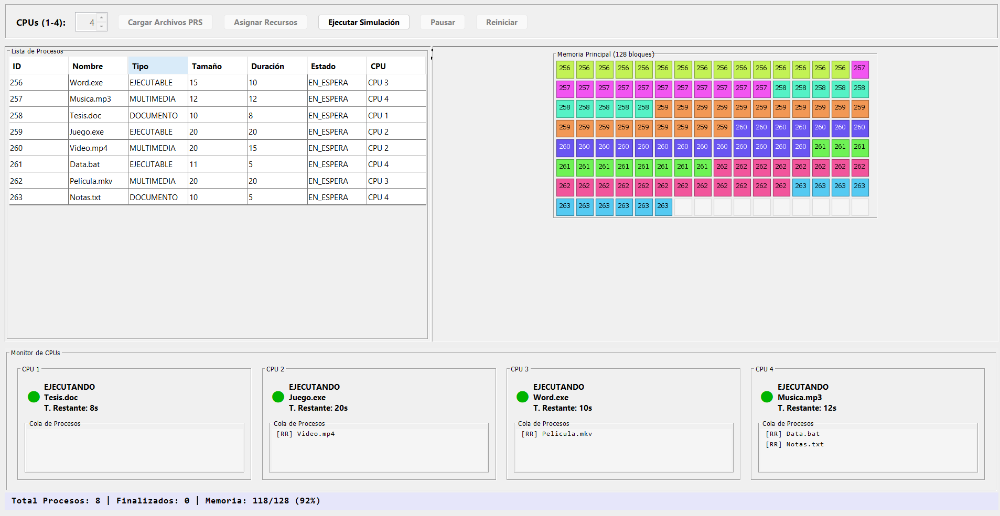

# Simulador de Procesos GUI App

[](https://github.com/Geovanni-Gonzalez/SimuladorDeProcesos-GUI-App/actions/workflows/ci.yml)

## Descripción
Simulador gráfico en Java para representar procesos, CPU y memoria, con modelos, lector de archivos y vistas Swing.

## Objetivo
Practicar sistemas operativos, simulacion de procesos e interfaces Java.

## Tecnologías utilizadas
- Java
- Swing
- POO
- Archivos .prs

## Funcionalidades principales
- Vistas de CPU y memoria
- Modelos de procesos
- Estados y tipos
- Lector de archivos
- Core de simulacion

## Mi rol
Modelé procesos, implementé simulacion y cree vistas de inspeccion.

## Aprendizajes clave
- Procesos y estados
- POO Java
- Swing
- Archivos de configuración

## Instalación y ejecución
```bash
cd SimuladorDeProcesos-GUI-App
javac -d out src/main/java/com/simulador/**/*.java
java -cp out com.simulador.ui.VentanaPrincipal
```
En PowerShell puede convenir compilar desde un IDE.

## Estructura del proyecto
- core/: CPU/memoria
- model/: procesos
- files/: lector
- ui/: ventanas
- usuario1.prs: ejemplo

## Capturas o demo


## Estado del proyecto
Proyecto académico funcional.

## Valor técnico demostrado
Demuestra simulacion de procesos, POO e interfaces Swing.

## Mejoras futuras
- Documentar .prs
- Crear Maven/Gradle
- Agregar pruebas

## Autor
Geovanni González  
Estudiante de Ingeniería en Computación  
GitHub: [Geovanni-Gonzalez](https://github.com/Geovanni-Gonzalez)


